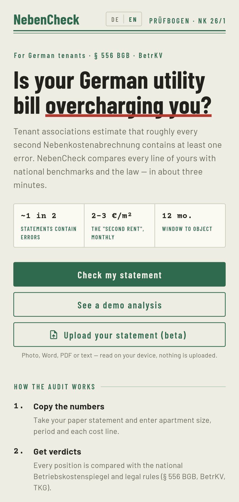
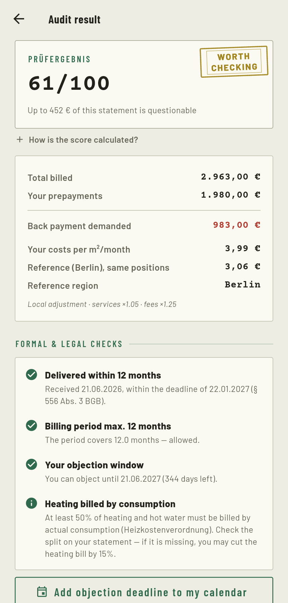
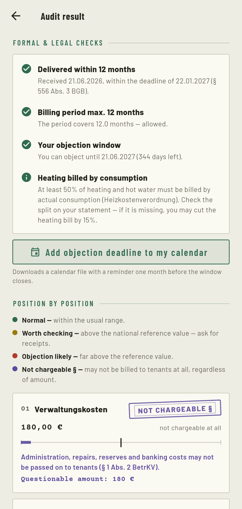
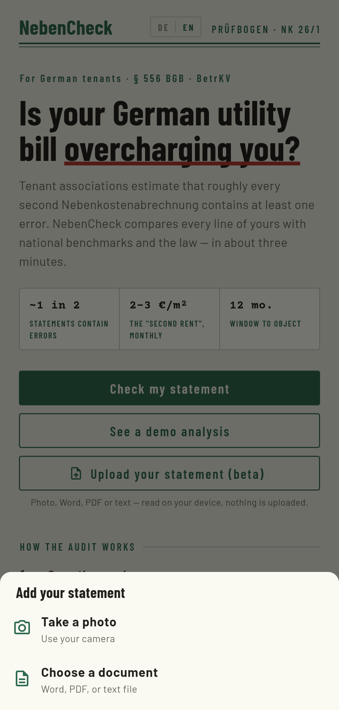
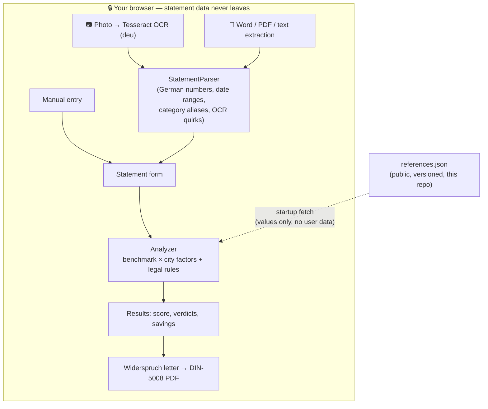

# NebenCheck

**Audit your German Nebenkostenabrechnung — in your browser, on your device, in about three minutes.**

[](https://nebencheck-ten.vercel.app)
[](https://github.com/Devastating-Phoenix/nebencheck/actions/workflows/ci.yml)
[](https://flutter.dev)
[](LICENSE)

Tenant associations estimate that roughly **every second German operating-cost
statement contains at least one error** — but checking one today means paying a
review service. NebenCheck makes it self-serve: enter (or photograph) your
statement, get a traffic-light verdict per cost line adjusted to your city, a
list of formal legal checks under § 556 BGB / BetrKV / HeizKV, and a
ready-to-send German objection letter (Widerspruch) as a DIN-5008 PDF.

**Everything runs in your browser. Your statement is never uploaded anywhere.**

> University prototype. Reference values approximate the DMB
> Betriebskostenspiegel, adjusted to your selected city. This is **not legal
> advice** (keine Rechtsberatung).

<p align="center">
  
  
  
  
</p>

---

## What it checks

**1. Benchmark findings.** Each cost category from § 2 BetrKV is converted to
€/m²/month and compared with a **city-adjusted** reference value. Ratios
≥ 1.25× are flagged 🟡 *worth checking*, ≥ 1.6× 🔴 *objection likely*, and the
questionable excess is summed into a savings estimate. Municipal charges
(property tax, water, waste) scale by the local fee level; building services
(caretaker, cleaning, garden) scale by regional wages; heating and insurance
are national markets and never scaled.

**2. Legal findings.** Formal rules that can invalidate a charge regardless of
its size:

| Check | Rule |
|---|---|
| 12-month delivery deadline | § 556 Abs. 3 BGB — a late statement generally voids back-payment demands |
| Billing period ≤ 12 months | § 556 Abs. 3 BGB |
| 12-month objection window | § 556 Abs. 3 Satz 5 BGB — with a live countdown and `.ics` calendar export |
| Non-apportionable costs | § 1 Abs. 2 BetrKV — flags administration, repairs, reserves, banking fees |
| Cable TV | TKG reform — not chargeable for periods after 30 June 2024 |
| Heating split | § 12 HeizKV — flat-rate-only billing entitles a 15 % cut |

**3. The letter.** A formal German Widerspruch citing each flagged position,
requesting receipt inspection (§ 259 BGB), declaring payment under reserve,
and setting a reply deadline — downloadable as a DIN-5008 PDF. The UI is
bilingual (DE/EN); the letter is always German, because its recipient is.

## Statement import (beta)

Skip manual entry: one button offers **Take a photo** (on-device OCR with a
German-trained model) or **Choose a document** (Word `.docx`, PDF, or plain
text — the embedded text is read directly, which beats OCR on accuracy). A
priority-aware German parser then extracts apartment size, billing period,
prepayments and cost lines — tolerant of OCR quirks like `m²` → `m?` — and
prefills the form for the user to review before anything is analyzed.

## Privacy & security by design

The interesting engineering constraint: a tool that reads **financial
documents** should be built so it *cannot* leak them, not merely promise it
won't.

- **On-device processing.** OCR (Tesseract WASM), Word/PDF text extraction,
  analysis and PDF generation all run in the browser. There is no backend that
  ever sees a statement.
- **Enforced, not promised.** A strict `Content-Security-Policy` limits
  `connect-src` to the app's own origin only — the browser itself blocks any
  script from sending data anywhere else. Plus HSTS, `nosniff`,
  `frame-ancestors 'none'`, `Referrer-Policy: no-referrer`, and a camera-only
  `Permissions-Policy`.
- **Zero third-party requests.** Fonts, OCR models and all libraries are
  self-hosted — no Google Fonts (a documented GDPR problem in Germany, see
  LG München, 3 O 17493/20), no CDN, no cookies, no tracking, no analytics.
  Even the live reference data is proxied through the app's own domain, so
  the user's IP never reaches GitHub.
- **Data minimisation.** Saved checks live only in the browser's localStorage,
  and tenant/landlord names are never persisted at all.
- In-app **Impressum & Datenschutzerklärung** (§ 5 DDG / Art. 13 DSGVO).

## Architecture



```
lib/
  models/models.dart            pure-Dart domain models
  data/benchmarks.dart          national reference values  ← data corrections here
  data/cities.dart              per-city cost factors       ← and here
  data/remote_config.dart       runtime overrides from references.json
  logic/analyzer.dart           the audit engine (unit-tested)
  logic/statement_parser.dart   OCR/document text → structured statement
  logic/letter_generator.dart   the Widerspruch generator
  logic/ocr_web.dart            JS-interop bridge to the on-device import
  state/app_state.dart          ChangeNotifier + local persistence (no names)
  screens/                      home → form → results → letter, about, legal
web/vendor/                     self-hosted OCR/PDF/Word libs + German model
```

The analysis logic and parser are pure Dart, so the test suite — **52 tests**,
including end-to-end fixtures built from real Tesseract output with genuine
OCR corruption — runs headless in seconds.

## Live reference data — contribute a correction

The benchmark values go stale as new surveys publish, so they live in a
**public, versioned data file** ([`references.json`](references.json)) that the
app fetches at startup, falling back to compiled defaults. **A merged change
goes live in minutes — no rebuild.** A scheduled GitHub Action
([`betriebskosten-watch.yml`](.github/workflows/betriebskosten-watch.yml))
watches for a newer DMB Betriebskostenspiegel and opens a PR with proposed
numbers for review.

If a number looks wrong or outdated:

1. **Open an issue** naming the value and citing a source (DMB or Haus & Grund
   publication, municipal fee schedule), **or**
2. **Open a pull request** editing [`references.json`](references.json) /
   [`lib/data/`](lib/data/) directly, with the source in the description.

Every value must be traceable to a published figure; interpolations are marked
as estimates (`note` fields in `cities.dart`).

## Running locally

Requires the [Flutter SDK](https://docs.flutter.dev/get-started/install) (stable).

```bash
flutter pub get
flutter run -d chrome                          # run in the browser
flutter test                                   # 52 headless unit tests
flutter build web --release --no-web-resources-cdn   # deployable build
```

(`--no-web-resources-cdn` keeps CanvasKit self-hosted — part of the
zero-third-party-requests guarantee above.)

## Sources

- **DMB Betriebskostenspiegel** — https://mieterbund.de/service/checks-formulare/betriebskosten/betriebskostenspiegel/
- **Haus & Grund / IW Consult Nebenkostenranking** — https://www.hausundgrund.de/nebenkostenranking-die-100-groessten-staedte-im-vergleich

## License

[PolyForm Noncommercial License 1.0.0](LICENSE) — free to use, modify, and
share for **any non-commercial purpose** (personal use, study, non-profits,
public institutions). **Commercial use is not permitted** without a separate
license from the copyright holder, who reserves all commercial rights.

Contributions are welcome under the same terms: by opening a pull request you
agree your contribution is licensed under this license, and you grant the
project's copyright holder the right to use it (including commercially).
